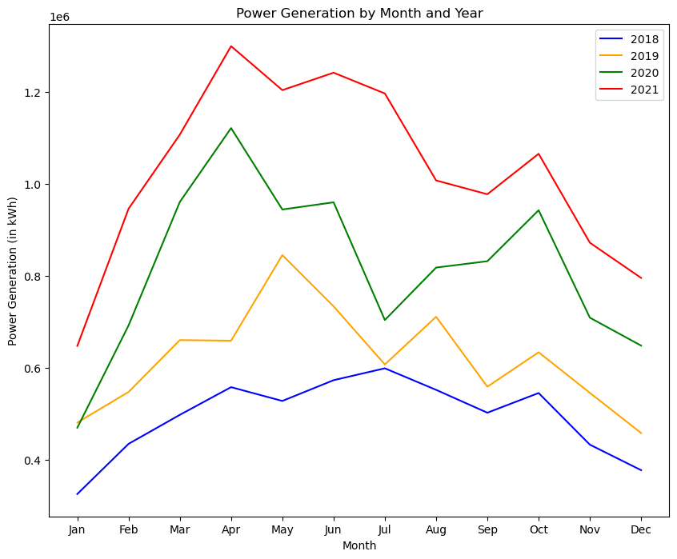

# 날씨와 태양광 발전량 분석

- 2018~2021년도 월별 태양광 생산량 히트맵과  선 그래프

 첫 번째 그래프는 한국에서 태양광 전력 생산량과 월 별로 나타낸 그래프입니다. 4개의 선이 있으며 년도 별로 그려져 있습니다. 왼쪽 축은 전력 생산량을, 오른쪽 축은 일조 시간을 의미합니다. 한국의 계절적 특징을 생각하여 그림을 살펴보면, 

**봄(3월~5월) : 4월과 5월에 일조시간이 많이 늘어나면서 생산량이 증가합니다. 봄에는 온도가 올라가면서 최적 온도인 25 도와 가까워지기 때문입니다.**

여름(6월~8월) : 일조시간이 많은 시기이지만, 날씨가 비교적 습하고 흐리기 때문에 생산량이 크게 증가하지 않습니다.  세 번째 표를 보면,  12년도부터 22년까지 월 별 습도에 대한 그래프입니다.  여름철에 급격히 습도가 증가하는 모습을 볼 수 있습니다.  이를 통해 습도로 인해 일조량이 감소할 수 있다고 파악할 수 있습니다.

 또한, 네 번째 그래프를 보면, 태풍이 8월과 9월에 대부분 발생합니다. 태풍으로 인한 날씨의 변화는 여러 날에 걸쳐 일어나는 경우가 많기 때문에, 해당 날들의 태양광 생산량은 줄어든다고 파악할 수 있 더운 여름철에는 태양광 패널의 온도가 올라가면서 최적 온도와 멀어지기 때문에 생산량이 감소합니다. 마지막 그래프는 태양광 생산을 하는 시간대인 오전 8시부터 오후 6시 까지 평균 기온을 나타낸 그래프입니다. 이곳에서 여름의 경우 해당 시간대의 평균 기온이 25도 이상임을 확인 할 수 있어, 계절 별 태양광 생산량과의 연관 관계를 알 수 있습니다.

**즉, 여름은 일조량이 상대적으로 증가하여 생산량이 증가할 것 같지만, 습도와 태풍의 영향으로 흐린 날이 많으며 최적의 온도를 넘어가는 시간대가 많아 오히려  봄과 가을에 비해 생산량이 감소하는 경향을 보입니다.**

**가을(9월~11월)에는 태양광 발전량이 증가합니다. 이는 7월에서 9월까지 일조 시간이 많아지면서 생산량도 가파르게 증가하기 때문입니다. 또한 가을에는 온도가 떨어져서 최적 온도와 가까워지기 때문입니다.**

겨울(12월~2월)에는 일조 시간이 적은 시기이기 때문에 생산량이 크게 감소합니다.  또한, 겨울철에는 태양광 패널의 온도가 낮아져서 최적 온도와 멀어지기 때문에 생산량이 감소합니다. 

**태양광의 최적의 온도는 25도 이며 1도 올라갈 때마다 0.5%의 효율이 떨어집니다.**

**따라서, 한국의 태양광 발전은 봄과 가을에 최적의 생산량을 보이고, 여름과 겨울에는 생산량이 감소합니다. 더불어, 태양광 패널의 최적 온도는 25도이기 때문에, 최적 온도와 멀어지면서 태양광 발전량이 감소한다는 것도 알 수 있습니다.**

- 태양광 생산량과 수요량의 상관관계
    
    
    
    
    
    

2018~2021년도 한국 월 별 태양광 생산량과 수요량을 나타내는 그래프입니다. 이 그래프를 통해 태양광 발전량과 전력 수요량의 상관 관계를 분석할 수 있습니다. 그래프의 y 축은 전력 생산량을, X 축은 전력 수요량을 나타냅니다. 그래프의 점은 각각의 월을 나타내고 있습니다.

**그래프를 자세히 살펴보면, 전력 수요량과 태양광 생산량에는 상관 관계가 있음을 알 수 있습니다. 일반적으로 태양광 발전량은 봄과 가을에 많이 생산되며 전력 수요량은 주로  여름과 겨울에 많이 필요합니다.** 

따라서, 이 그래프는 전력 생산량과 전력 수요량의 관계를 파악하고, 전력 생산량을 조정하여 전력 수요에 맞게 생산하는 데에 도움을 줄 수 있습니다.

- 태양광 생산량과 기온의 상관관계
    
    
- 

위의 그래프는 한국에서 태양광 생산량과 기온을 나타내는 그래프입니다. 이 그래프를 통해 태양광 발전량과 기온의 상관관계를 분석할 수 있습니다.

그래프의 왼쪽 축은 전력 생산량을, 오른쪽 축은 기온을 나타냅니다. 그래프의 점은 각각의 월을 나타내고 있습니다.

**태양광 패널이 생산할 수 있는 에너지의 양은 받는 햇빛의 양에 따라 달라지기 때문에 태양광 발전 생산은 온도와 직접적인 관련이 있습니다.**

온도가 상승하면 태양 전지판의 출력이 감소합니다. 온도가 상승하면 패널 반도체 소재의 전기전도가 낮아져 패널 효율이 떨어지기 때문입니다. 그러나 온도로 인한 효율 감소는 크지 않으며 태양광 패널은 고온에서도 전기를 생산할 수 있습니다. 또한 박막 태양 전지와 같은 일부 태양 전지판 기술은 다른 것보다 온도 변화에 덜 민감합니다.

반면에 낮은 온도는 패널 표면의 눈이나 서리가 반도체 재료에 도달하는 햇빛의 양을 감소시킬 수 있기 때문에 태양광 발전 생산에도 영향을 미칠 수 있습니다.

**하지만, 대체적으로 기온이 증가할수록 태양광의 생산량이 늘어난다는 상관관계를 해당 그래프에서 확인할 수 있습니다.**

- 태양광 생산량과 습도의 상관관계
    
    
    
    위의 그래프는 한국에서의 태양광 생산량과 습도를 나타내는 그래프입니다. 이 그래프를 통해 태양광 발전량과 습도의 상관관계를 분석할 수 있습니다.
    
    그래프의 y 축은 전력 생산량을, X 축은 습도를 나타냅니다. 그래프의 점은 각각의 월을 나타내고 있습니다.
    
    일반적으로 습도가 높으면 공기 중의 수증기가 햇빛을 흡수하고 산란시켜 패널에 도달하는 양이 줄어들기 때문에 태양광 패널의 출력이 감소할 수 있습니다. 특히 습도가 높고 일사량이 적은 지역에서는 물방울과 구름이 존재하여 태양광 발전 생산이 크게 감소할 수 있습니다.
    
    **하지만, 공기 중의 수분 증가가 태양 전지판의 온도를 낮추는 데 도움이 될 수 있고, 이는 다시 효율을 높일 수 있기 때문입니다. 공기가 더 습하면 태양열 패널에서 주변 공기로 열을 쉽게 전달하여 패널을 건조한 조건보다 더 시원하게 유지할 수 있습니다.**
    
    또한 한국의 기후는 대기 중 입자상 물질의 발생률이 높은 특징이 있어 태양광 패널에 도달하는 햇빛의 양이 줄어들 수 있습니다. 그러나 공기 중의 습기는 미립자 물질의 영향을 완화하여 더 많은 햇빛이 패널에 도달하고 출력을 증가시키는 데 도움이 될 수 있습니다.
    
    **따라서, 이 그래프는 영향이 크지는 않더라도 태양광 생산량과 습도는 상관 관계가 있다는 것을 확인할 수 있습니다.**
    

- 태양광 생산량과 풍속의 상관관계
    
    
    
    위의 그래프는 한국에서의 태양광 생산량과 풍속을 나타내는 그래프입니다. 이 그래프를 통해 태양광 발전량과 풍속의 상관관계를 분석할 수 있습니다.
    
    그래프의 왼쪽 축은 전력 생산량을, 오른쪽 축은 풍속을 나타냅니다. 그래프의 점은 각각의 월을 나타내고 있습니다.
    
    **태양열 출력과 풍속 사이의 관계는 일반적으로 독립적입니다. 그러나 풍속이 태양광 발전 출력에 간접적으로 영향을 미칠 수는 있습니다.**
    
    풍속은 태양 전지판의 온도에 영향을 줄 수 있습니다. 높은 풍속은 패널을 식히는 데 도움이 되어 효율성과 출력을 높일 수 있습니다. 이는 태양광 패널이 낮은 온도에서 작동할 때 햇빛을 전기로 변환하는 데 더 효율적이기 때문입니다.
    
    하지만, 풍속은 태양광 패널 표면에 쌓이는 먼지와 파편의 양에 영향을 미칠 수 있습니다. 바람이 많이 불면 패널에 먼지와 이물질이 날리면 햇빛의 일부가 태양 전지에 도달하는 것을 차단하여 패널의 효율을 떨어뜨릴 수 있습니다. 따라서 풍속이 높은 지역에서는 효율성과 출력을 유지하기 위해 태양광 패널을 정기적으로 청소해야 할 수 있습니다.
    
    **따라서, 풍속과 태양광의 생산량의 상관 관계는 확인하기 어렵다는 걸 확인할 수 있습니다.**
    

- 태양광 생산량 데이터 분석
    
    

태양광 생산량 데이터 분석을 통해 과거의 전력 사용 패턴을 파악하고, 이를 바탕으로 미래의 태양광 생산량을 예측합니다. 이를 위해 다양한 머신러닝 알고리즘을 활용하며, 태양광 생산량 예측 정확도를 높이기 위해 데이터 전처리 작업도 진행합니다.

우리는 위의 날씨와 태양광 생산량의 상관 관계를 통해 태양광 생산량을 좀 더 정확하게 예측하였습니다.

- 머신러닝으로 예측한 값 (WeightedEnsemble_L2)(19~20년 학습) 21년 예측
    
    
    

**위의 데이터 분석을 통해 상관 계수 0.1 이상의 데이터만 사용하여 예측한 결과입니다.**  습도, 기온 데이터와 태양광 생산량을 2019년~ 2020년 데이터를 학습한 뒤 2021년 데이터를 예측한 모델입니다.  AWS에서 제작한 autogluon 라이브러리를 사용하여 NeuralNetFastAI, KNeighborDist, WeightedEnsemble_L2, CatBoost, LightGB 중에 예측한 모델 중 가장 loss가 적은 모델과 가중치를 반환합니다. **예측 데이터가 가장 좋은 WeightedEnsemble_L2를 사용하여 예측 값과 실제 2021년의 수요 값을 비교한 값입니다.** 빨간색 선은 실제 데이터값을 나타내며, 파란색 선은 19년도부터 20년까지의 데이터를 기준으로 예측한 데이터 값을 나타냅니다.

- LSTM으로 예측한 값(19~20년 학습) 21년 예측
    
    
    

**위의 데이터 분석을 통해 상관 계수 0.1 이상의 데이터만 사용하여 예측한 결과입니다.**  습도, 기온 데이터와 태양광 생산력 2012년~ 2020년 기간에서 8:00~18:00 사이의 시간 별로 데이터를 사용하여 학습했습니다. 학습한 가중치를 사용하여 2020년의 데이터로 2021년 태양광 발전량 예측한 값입니다. **LSTM 모델을 사용하여 예측하였으며 Parameter는 wide_size로는 365일로 하여 1년 데이터로 학습**하며 50번을 반복하여 가장 정확한 값을 출력한 사진입니다. 파란색 선은 실제 데이터 값을 나타내며, 주황색 선은 19년도부터 20년까지의 데이터를 기준으로 예측한 데이터 값을 나타냅니다.

- 예측과 실제 데이터 그래프
    
    
    

# 사용하지 않는 데이터

 가장 첫 번째 그래프는 2018~2021년도 한국 월 별 태양광 생산량 히트 맵을 그린 그림입니다. 

